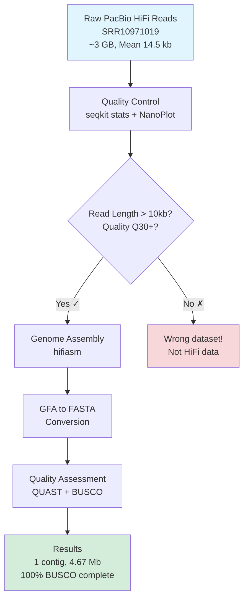
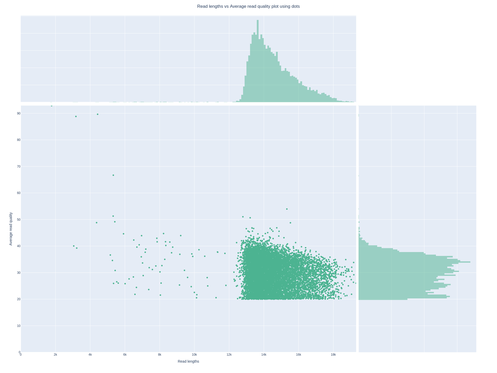
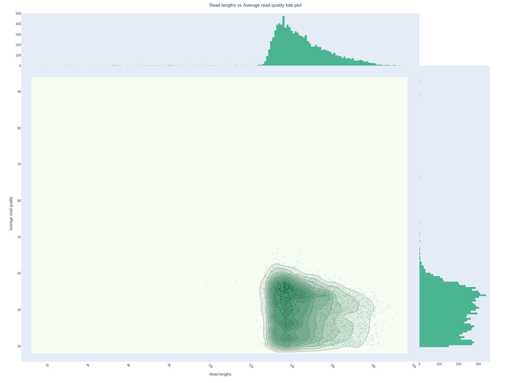
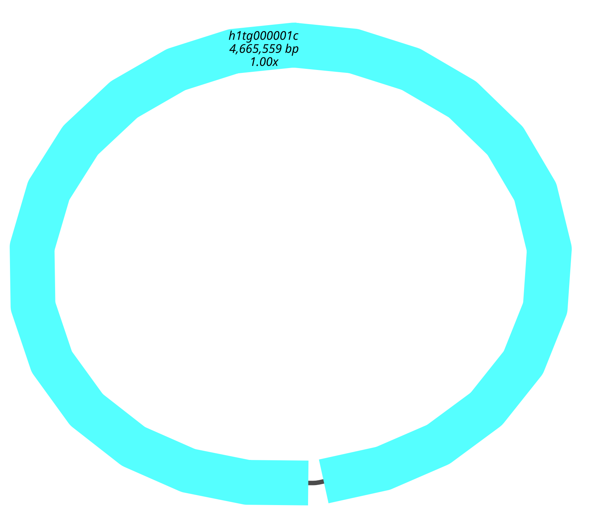

# _E. coli_ PacBio HiFi Genome Assembly

Hands-on project demonstrating bacterial genome assembly using PacBio HiFi long-read sequencing. Successfully assembled _E. coli_ K-12 into a single circular contig with complete genome coverage, showing the advantages of long reads over short-read approaches.

## Dataset

Used publicly available PacBio HiFi data for _E. coli_ K-12:

**Accession:** SRR10971019 (NCBI SRA)
**Sequencing platform:** PacBio Sequel II
**Read length:** Mean 14.5 kb (range 1-20 kb)
**Quality:** Q30+ (>99.9% accuracy per base)
**Coverage:** ~30-50× after HiFi consensus
**File size:** ~3 GB

## Methods




**Quality Control**
Used seqkit to verify read length distribution (confirmed mean >10 kb indicating genuine HiFi data, not Illumina). Ran NanoPlot for detailed quality visualization - confirmed Q30+ quality scores across most reads, with some variation due to polymerase processivity differences.





**Assembly**
Assembled with hifiasm using default parameters for bacterial genomes. Chose hifiasm because it's optimized for high-accuracy HiFi reads and doesn't waste time on error correction that's already been done during sequencing. Converted the assembly graph (GFA format) to FASTA for downstream analysis.
Quality Assessment

**QUAST:** Basic assembly statistics (contig count, N50, total length, GC%)
**BUSCO:** Completeness check using 124 universal bacterial single-copy orthologs

## Results

**Assembly Statistics**

**Total length:** 4,665,559 bp
**Number of contigs:** 1 (complete circular chromosome)
**N50:** 4,665,559 bp (entire genome in one piece)
**GC content:** 50.77%

## BUSCO Completeness

**Complete single-copy:** 124/124 (100%)
**Complete duplicated:** 0/124 (0%)
**Fragmented:** 0/124 (0%)
**Missing:** 0/124 (0%)


The assembly graph shows a clean circular structure with a small overlap region (~15.5 kb) representing the collapsed rRNA operons - this is expected because the 7 rRNA operons in E. coli are nearly identical and the HiFi reads (mean 15 kb) can't span enough to distinguish all copies.

## What I Learned

**HiFi vs Illumina:** Coming from Illumina sequencing background where bacterial genomes typically fragment into 100+ contigs, achieving a single-contig assembly really showed why long reads matter. The reads span repetitive regions that break short-read assemblies.
Error correction isn't always necessary: HiFi reads already have consensus built in (multiple passes over the same molecule during sequencing), so assemblers like hifiasm skip the error correction step that's needed for Oxford Nanopore data. This makes the workflow faster.
Assembly graphs preserve information: The GFA format shows structural ambiguity that gets lost when converting to FASTA. The circular topology and collapsed repeats are visible in Bandage but not in the final sequence file.
BUSCO validation: Getting 100% completeness confirmed the assembly covers the entire genome with no major gaps or duplications. This is independent validation beyond just assembly statistics.

## Technical Details

**Software Versions**

hifiasm v0.21.0
seqkit v2.12.0
NanoPlot v1.46.2
QUAST v5.3.0
BUSCO v5.5.0
Bandage (for visualization)

**Computational Requirements**

**Platform:** Linux (Ubuntu 22.04)
**CPU:** 8 threads
**RAM:** 16 GB
**Runtime:** ~4 hours total
**Storage:** ~10 GB (including raw data)

**Installation**
Used conda environment for dependency management:
```
bashconda env create -f environment.yml
conda activate longread-assembly
```

**Note:** BUSCO requires numpy 1.x (not 2.x). If you get import errors, the environment.yml file specifies `numpy<2` which fixes this issue.

## Repository Structure
```
ecoli-hifi-assembly/
├── README.md
├── environment.yml
├── .gitignore
├── scripts/
│   ├── 01_download_data.sh
│   ├── 02_quality_control.sh
│   ├── 03_assembly.sh
│   └── 04_assessment.sh
├── results/
│   ├── qc/
│   ├── assembly/
│   └── assessment/
└── figures/
    └── assembly_graph.png
```

# Running the Analysis

```
# Download data
cd scripts
bash 01_download_data.sh

# Quality control
bash 02_quality_control.sh

# Assembly
bash 03_assembly.sh

# Quality assessment
bash 04_assessment.sh
```

**Comparison to Short-Read Assembly**

From my previous work with Illumina sequencing (150 bp paired-end for 16S rRNA analysis), I know bacterial genomes typically fragment into hundreds of contigs when using short reads. The assembler can't bridge repetitive regions like rRNA operons because the reads are too short to span them, so you end up with broken assemblies that need additional scaffolding steps to piece together.
With HiFi reads averaging 15 kb, the assembler could span most repeats and produce a single contig representing the complete chromosome. The only region that collapsed was the rRNA operons (~15.5 kb total of nearly identical sequence), which makes sense since the read length wasn't quite long enough to distinguish all 7 copies. If I had used ultra-long Oxford Nanopore reads (100+ kb), even those would likely resolve into their proper locations.
The main advantage I saw was not needing to worry about scaffolding or gap-filling - the assembly was essentially complete in one step. For bacterial genomics, HiFi reads seem like the clear choice when you want a finished genome rather than a draft assembly.
