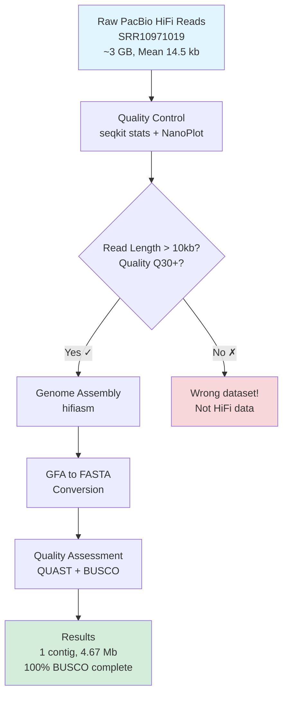
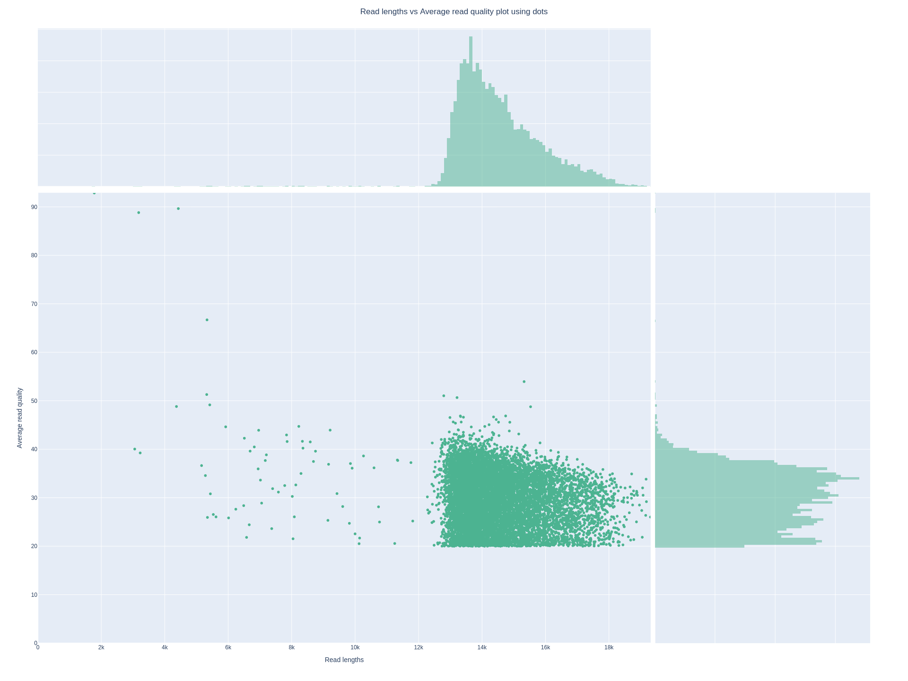
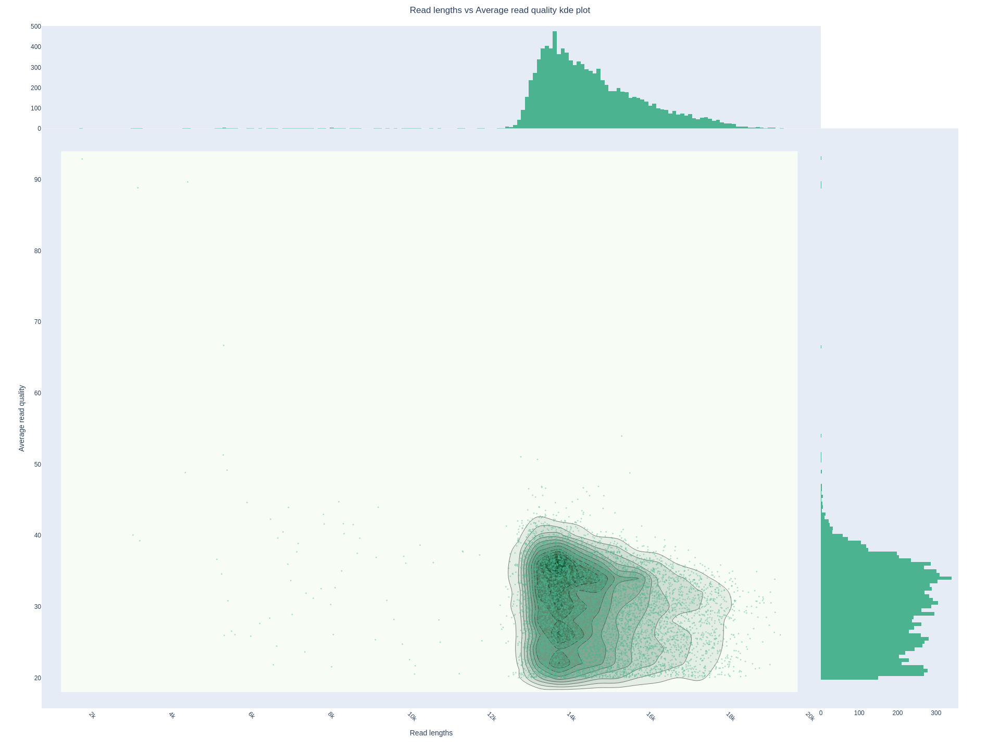
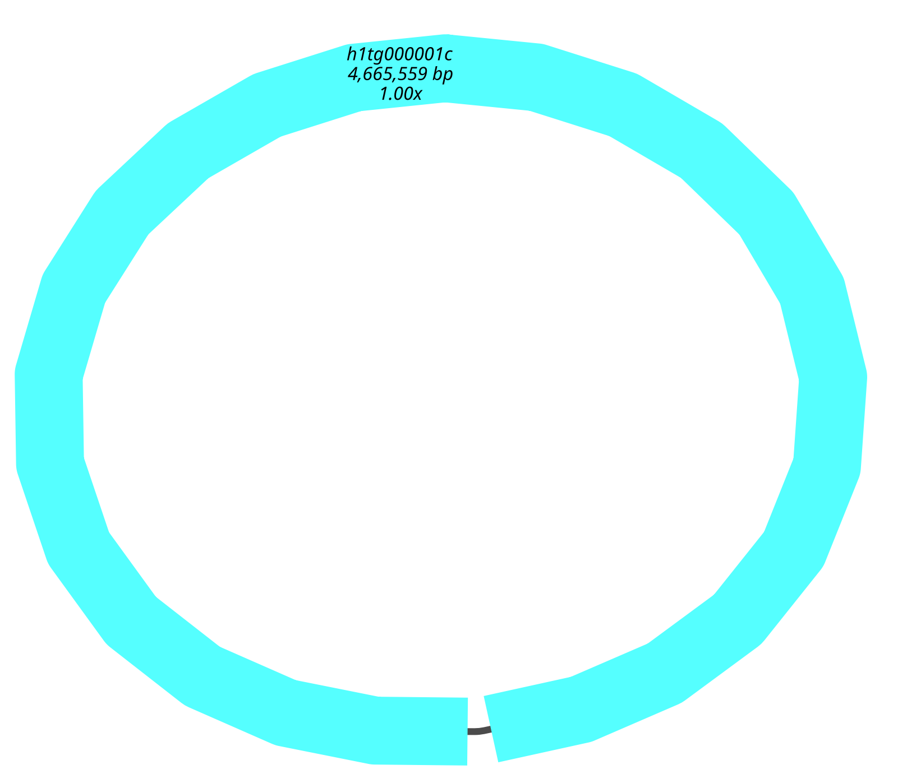

# _E. coli_ PacBio HiFi Genome Assembly

End-to-end bacterial genome assembly pipeline using PacBio HiFi long-read sequencing. Assembled _E. coli_ K-12 into a single circular contig with complete genome coverage, demonstrating the advantages of long reads over short-read approaches.

## Dataset

Used publicly available PacBio HiFi data for _E. coli_ K-12:

**Accession:** SRR10971019 (NCBI SRA)
**Sequencing platform:** PacBio Sequel II
**Read length:** Mean 14.5 kb (range 1-20 kb)
**Quality:** Q30+ (>99.9% accuracy per base)
**Coverage:** ~30-50× after HiFi consensus
**File size:** ~3 GB

## Methods


```mermaid
flowchart TD
    A[Raw PacBio HiFi Reads<br/>SRR10971019<br/>~3 GB, Mean 14.5 kb] --> B[ Quality Control<br/>seqkit stats + NanoPlot]
    B --> C{Read Length > 10kb?<br/>Quality Q30+?}
    C -->|Yes ✓| D[ Genome Assembly<br/>hifiasm]
    C -->|No ✗| E[Wrong dataset!<br/>Not HiFi data]
    D --> F[ GFA to FASTA<br/>Conversion]
    F --> G[ Quality Assessment<br/>QUAST + BUSCO]
    G --> H[ Results<br/>1 contig, 4.67 Mb<br/>100% BUSCO complete]
    
    style A fill:#e1f5ff
    style H fill:#d4edda
    style E fill:#f8d7da
```


**Quality Control**
Used seqkit to verify read length distribution (confirmed mean >10 kb indicating genuine HiFi data, not Illumina). Ran NanoPlot for detailed quality visualization - confirmed Q30+ quality scores across most reads, with some variation due to polymerase processivity differences.





**Assembly**
Assembled with hifiasm using default parameters for bacterial genomes. Chose hifiasm because it's optimized for high-accuracy HiFi reads and doesn't waste time on error correction that's already been done during sequencing. Converted the assembly graph (GFA format) to FASTA for downstream analysis.
Quality Assessment

**QUAST:** Basic assembly statistics (contig count, N50, total length, GC%)
**BUSCO:** Completeness check using 124 universal bacterial single-copy orthologs

## Results

**Assembly Statistics**

**Total length:** 4,665,559 bp
**Number of contigs:** 1 (complete circular chromosome)
**N50:** 4,665,559 bp (entire genome in one piece)
**GC content:** 50.77%

## BUSCO Completeness

**Complete single-copy:** 124/124 (100%)
**Complete duplicated:** 0/124 (0%)
**Fragmented:** 0/124 (0%)
**Missing:** 0/124 (0%)


The assembly graph shows a clean circular structure with a small overlap region (~15.5 kb) representing the collapsed rRNA operons - this is expected because the 7 rRNA operons in E. coli are nearly identical and the HiFi reads (mean 15 kb) can't span enough to distinguish all copies.

## Key Findings

**HiFi vs Illumina contiguity:** Bacterial genomes assembled from short reads typically fragment into 100+ contigs due to repetitive regions. HiFi reads spanning 15 kb bridge repeats that short reads cannot, producing a single-contig assembly in one step without scaffolding.

**Error correction is built in:** HiFi reads already incorporate consensus from multiple polymerase passes over the same molecule, so hifiasm skips the error-correction stage required for raw Oxford Nanopore data. This simplifies the pipeline and reduces runtime.

**Assembly graphs preserve information lost in FASTA:** The GFA format captures structural ambiguity (circular topology and collapsed rRNA repeats) that disappears when converting to FASTA. Bandage graph visualisation is a necessary step for interpreting assembly results, not just a cosmetic one.

**BUSCO provides independent completeness validation:** 100% completeness against 124 universal bacterial orthologs confirms full genome coverage independent of reference comparison. This is a stronger claim than assembly statistics alone.

## Technical Details

**Software Versions**

hifiasm v0.21.0
seqkit v2.12.0
NanoPlot v1.46.2
QUAST v5.3.0
BUSCO v5.5.0
Bandage (for visualization)

**Computational Requirements**

**Platform:** Linux (Ubuntu 22.04)
**CPU:** 8 threads
**RAM:** 16 GB
**Runtime:** ~4 hours total
**Storage:** ~10 GB (including raw data)

**Installation**
Used conda environment for dependency management:
```
bashconda env create -f environment.yml
conda activate longread-assembly
```

**Note:** BUSCO requires numpy 1.x (not 2.x). If you get import errors, the environment.yml file specifies `numpy<2` which fixes this issue.

## Repository Structure
```
ecoli-hifi-assembly/
├── README.md
├── environment.yml
├── .gitignore
├── scripts/
│   ├── 01_download_data.sh
│   ├── 02_quality_control.sh
│   ├── 03_assembly.sh
│   └── 04_assessment.sh
├── results/
│   ├── qc/
│   ├── assembly/
│   └── assessment/
└── figures/
    └── assembly_graph.png
```

# Running the Analysis

```
# Download data
cd scripts
bash 01_download_data.sh

# Quality control
bash 02_quality_control.sh

# Assembly
bash 03_assembly.sh

# Quality assessment
bash 04_assessment.sh
```

## Pipeline Series

1. **_E. coli_ HiFi Assembly** (this repo): haploid bacterium, 1 contig, 100% BUSCO
2. [**_Candida albicans_ Diploid Assembly**](https://github.com/vikos77/Candida-HIFI-Assembly): diploid fungus, HiFi-only `--primary`, 209 contigs, 95.8% BUSCO
3. [**_S. cerevisiae_ Hi-C Phased Assembly**](https://github.com/vikos77/yeast-hifi-hic-assembly): diploid yeast, HiFi+Hi-C, 17+16 contigs, chromosome-level, 96%/89% BUSCO

## Comparison to Short-Read Assembly

Short-read assemblers (150 bp paired-end Illumina) cannot bridge repetitive regions like rRNA operons, producing fragmented assemblies that require additional scaffolding. With HiFi reads averaging 15 kb, the assembler spans most repeats and produces a single contig representing the complete chromosome.

The one collapsed region is the rRNA operon cluster (~15.5 kb of nearly identical sequence across 7 copies, visible as a small loop in the Bandage graph. Ultra-long Nanopore reads (100+ kb) would likely resolve even this region. For finished bacterial genome assembly, HiFi is the practical choice: complete in a single assembly step with no gap-filling required.
